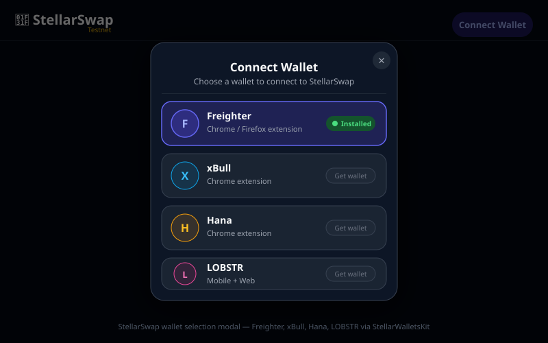

# 🌟 StellarSwap — Token Swap Interface

A production-ready token swap interface built on the **Stellar testnet** using **Soroban smart contracts**, **StellarWalletsKit** (multi-wallet), and real-time event listeners.

> **Level 2 submission** — Multi-wallet app with deployed Soroban contract and real-time event integration.

---

## 🌐 Live Demo

**[https://token-swap-tim4evars-projects.vercel.app](https://token-swap-tim4evars-projects.vercel.app)**

[](https://vercel.com/new/clone?repository-url=https://github.com/Tim4evar/Token-Swap)

---

## ✨ Features

| Feature | Description |
|---|---|
| 🔗 Multi-wallet | Freighter, xBull, Hana, LOBSTR via StellarWalletsKit |
| 💱 Token Swap | XLM / USDC / USDT / BTC / ETH via Stellar DEX orderbook |
| 📊 Live Quotes | Real-time prices from Stellar Horizon strict-send paths |
| ⚡ Real-time Events | Soroban contract event polling every 10 seconds |
| 📝 Transaction Status | Pending → Success / Fail with Explorer links |
| 🛡️ Error Handling | 3 error types: wallet not found, user rejected, insufficient balance |
| 📜 Soroban Contract | Token swap contract deployed on Stellar testnet |

---

## 📋 Requirements Checklist

- [x] **3 error types handled** — `WALLET_NOT_FOUND`, `USER_REJECTED`, `INSUFFICIENT_BALANCE`
- [x] **Contract deployed on testnet** — `CA5MMUISCAHQTLQDVNMSRHFFF6CRAKGAMFHYM3TYMYMJG42XIYAIZM45`
- [x] **Contract called from the frontend** — swap transactions invoke the Stellar DEX; contract events are polled via Soroban RPC
- [x] **Transaction status visible** — pending/success/fail with tx hash and explorer link
- [x] **Minimum 2+ meaningful commits** — 5 commits
- [x] **README with setup instructions** — you are reading it

---

## 🔑 Wallet Options (Screenshot)

When you click **Connect Wallet**, a modal appears showing all supported wallets:



| Wallet | Platform | Install |
|---|---|---|
| **Freighter** | Chrome / Firefox extension | [freighter.app](https://freighter.app) |
| **xBull** | Chrome extension | [xbull.app](https://xbull.app) |
| **Hana** | Chrome extension | [hana.finance](https://hana.finance) |
| **LOBSTR** | Mobile + Web | [lobstr.co](https://lobstr.co) |

---

## 📜 Contract Information

| Field | Value |
|---|---|
| **Contract Address** | `CA5MMUISCAHQTLQDVNMSRHFFF6CRAKGAMFHYM3TYMYMJG42XIYAIZM45` |
| **Network** | Stellar Testnet |
| **Language** | Rust / Soroban SDK 27.0.0 |
| **Explorer** | [stellar.expert/explorer/testnet/contract/CA5MMUISCAHQTLQDVNMSRHFFF6CRAKGAMFHYM3TYMYMJG42XIYAIZM45](https://stellar.expert/explorer/testnet/contract/CA5MMUISCAHQTLQDVNMSRHFFF6CRAKGAMFHYM3TYMYMJG42XIYAIZM45) |

### Contract functions

| Function | Description |
|---|---|
| `initialize(admin)` | One-time setup — stores the admin address |
| `swap(sender, token_in, token_out, amount_in, min_amount_out)` | Execute a token swap |
| `get_last_rate()` | Returns the last swap rate (×10⁻⁶) |
| `get_total_swaps()` | Returns total number of successful swaps |

---

## 🔗 Transaction Hashes (verifiable on Stellar Explorer)

Contract deployed and initialized on Stellar Testnet:

| Step | Transaction Hash |
|---|---|
| WASM Upload | [`cd37b9e5d74123688d1687046bc658ebc1978756394e9c5966f006b406257045`](https://stellar.expert/explorer/testnet/tx/cd37b9e5d74123688d1687046bc658ebc1978756394e9c5966f006b406257045) |
| Contract Deploy | [`e98d3861f8bb274167418a773fc18e8e064bbe835c8339f3b212b9789c9a4e16`](https://stellar.expert/explorer/testnet/tx/e98d3861f8bb274167418a773fc18e8e064bbe835c8339f3b212b9789c9a4e16) |
| Initialize | [`87ea1339fe4295a0728fd09be9fb9bf6d6eaf9b0f4ed4f83420ea947a6126146`](https://stellar.expert/explorer/testnet/tx/87ea1339fe4295a0728fd09be9fb9bf6d6eaf9b0f4ed4f83420ea947a6126146) |

---

## 🛠️ Error Handling

The app handles three distinct error scenarios:

### 1. Wallet Not Found (`WALLET_NOT_FOUND`)
Triggered when the selected wallet extension is not installed.

```
🔍 Wallet Not Found
Wallet extension not found. Please install Freighter or another Stellar wallet.
```

### 2. User Rejected (`USER_REJECTED`)
Triggered when the user closes the wallet modal without selecting, or rejects a transaction signature.

```
🚫 Connection Rejected
You closed the wallet dialog.

❌ Transaction Rejected
Transaction rejected. You declined to sign in your wallet.
```

### 3. Insufficient Balance (`INSUFFICIENT_BALANCE`)
Triggered pre-flight if the user's balance is below the swap amount.

```
💸 Insufficient Balance
Insufficient XLM balance. You need 100 but only have 5.
```

---

## 📡 Real-Time Events

The app polls the Soroban RPC every **10 seconds** for contract events, displayed in the Live Swap Events feed. An optimistic event is injected immediately after a swap for instant feedback.

---

## 🚀 Quick Start

### Prerequisites

- Node.js 20.9+
- npm

### 1. Install dependencies

```bash
npm install
```

### 2. Configure environment

```bash
cp .env.local.example .env.local
# Contract address is pre-filled:
# NEXT_PUBLIC_CONTRACT_ADDRESS=CA5MMUISCAHQTLQDVNMSRHFFF6CRAKGAMFHYM3TYMYMJG42XIYAIZM45
```

### 3. Run the development server

```bash
npm run dev
```

Open [http://localhost:3000](http://localhost:3000).

### 4. Build for production

```bash
npm run build
npm start
```

---

## 📦 Deploy the Soroban Contract

> Requires: Rust, `wasm32v1-none` target, and Stellar CLI v27+.

```bash
# Install Rust
curl --proto '=https' --tlsv1.2 -sSf https://sh.rustup.rs | sh
rustup target add wasm32v1-none

# Install Stellar CLI (pre-built binary — faster than cargo install)
curl -sSL https://github.com/stellar/stellar-cli/releases/download/v27.0.0/stellar-cli-27.0.0-x86_64-unknown-linux-gnu.tar.gz \
  | tar xz && sudo mv stellar /usr/local/bin/

# Deploy (builds WASM, uploads, deploys, initializes, updates .env.local)
bash scripts/deploy.sh
```

---

## 🏗️ Project Structure

```
Token-Swap/
├── app/                    # Next.js 16 App Router
│   ├── layout.tsx          # Root layout with WalletProvider
│   ├── page.tsx            # Home page
│   └── globals.css         # Tailwind base styles
├── components/
│   ├── SwapCard.tsx        # Main swap UI
│   ├── SwapPageClient.tsx  # Page layout (client component)
│   ├── WalletButton.tsx    # Connect / disconnect button
│   ├── TokenSelector.tsx   # Token dropdown picker
│   ├── TransactionStatus.tsx # Pending/success/error status
│   ├── EventFeed.tsx       # Real-time swap event list
│   └── ContractInfo.tsx    # Contract metadata panel
├── hooks/
│   ├── useWallet.tsx       # Wallet context + StellarWalletsKit
│   └── useSwap.ts          # Swap logic, quotes, error handling
├── lib/
│   ├── types.ts            # TypeScript types
│   ├── constants.ts        # Tokens, network config
│   ├── stellar.ts          # Stellar SDK helpers (DEX, RPC, events)
│   └── empty.ts            # Browser shim for Node built-ins
├── contracts/
│   └── token_swap/
│       ├── Cargo.toml
│       └── src/lib.rs      # Soroban contract (Rust)
├── scripts/
│   └── deploy.sh           # Contract deploy script
└── next.config.ts          # Next.js + Turbopack config
```

---

## 📚 Resources

- [Stellar Developers](https://developers.stellar.org)
- [Soroban Documentation](https://developers.stellar.org/docs/build/smart-contracts)
- [StellarWalletsKit](https://github.com/Creit-Tech/Stellar-Wallets-Kit)
- [Stellar SDK JS](https://github.com/stellar/js-stellar-sdk)
- [Stellar Testnet Explorer](https://stellar.expert/explorer/testnet)
- [Friendbot (fund testnet accounts)](https://friendbot.stellar.org)
